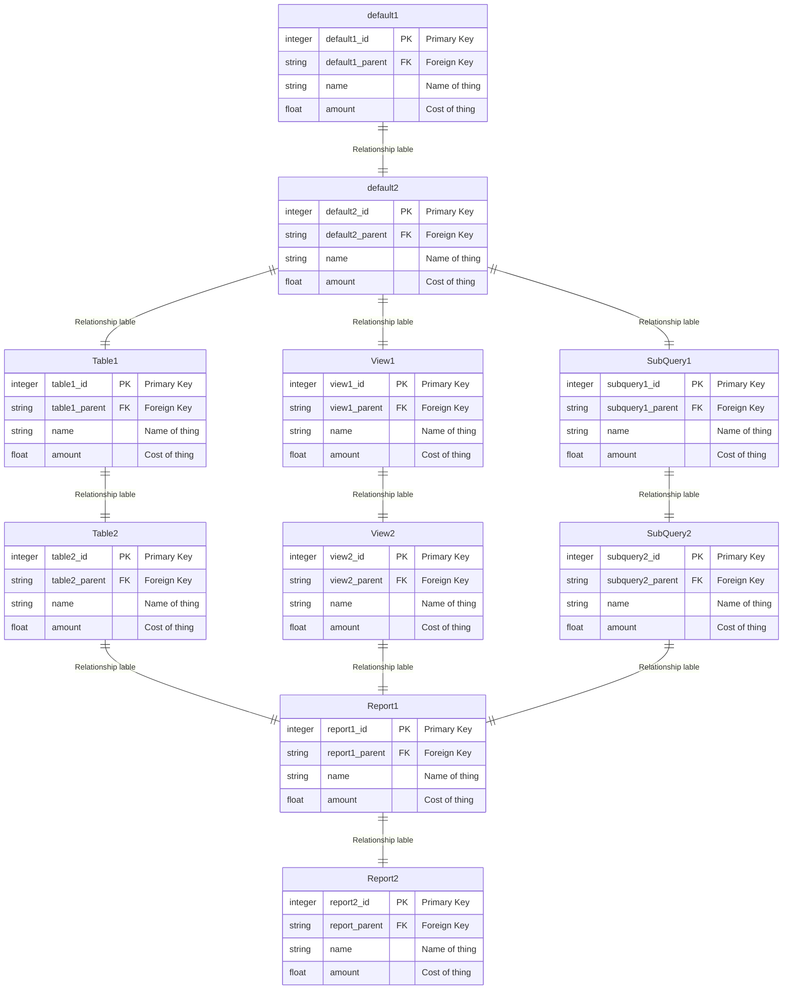

---
---

---
title: Mermaid
---
# Introduction

I use [Mermaid](https://mermaid.js.org) to create diagrams to help me with the design and documentation of software I'm creating, including COTS packages such as the Primavera applications that can be found in Oracle's [Construction and Engineering](https://docs.oracle.com/en/industries/construction-engineering/index.html) industry sector.

Some of the Mermaid diagrams can be themed using css, and having created a simple theme for the Entity Relationships, I am hoping to create more.  The idea is for these themes to be used as a template whenever I need to create the diagram.

# Entity Relationships

Entity Relationships in Mermaid can use their actual name or an alias.  By using an alias, I can treat the letters it starts with as if it is a CSS class, and also provide a style for that class.  My Entity Relationship provides a different colour scheme for a Tables and Views when documenting database schemas.  It also includes different colour schemes for Sub-Queries and the resulting data model when building reports and data feeds.  This has been very useful for complex data models used in [Oracle Analytics Publisher](https://www.oracle.com/uk/middleware/technologies/analytics-publisher.html).

Here are the themes:

| Name      | Alias prefix  | Basic Colour |
| --------- | ------------- | ------------ |
| Table     | tbl           | Blue         |
| View      | vie           | Green        |
| Sub-Query | sub           | Red          |
| Final     | fin           | Yellow       |
| Default   | anything else | Grey\Blue    |

